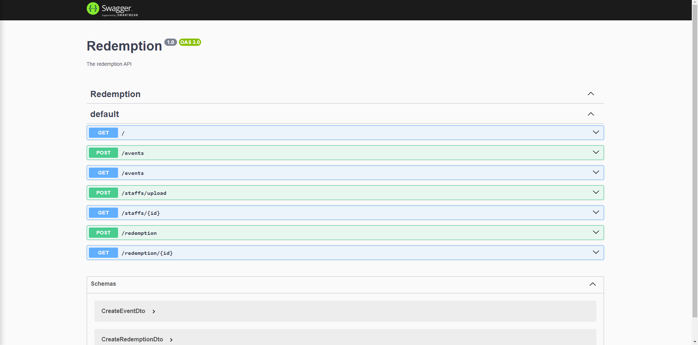
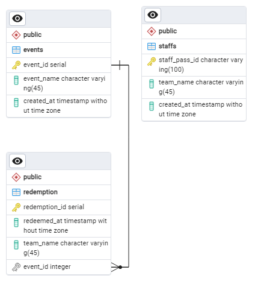
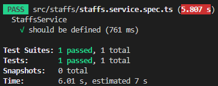
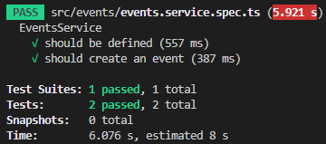
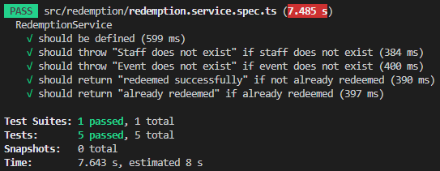

# Redemption System Web Service
### This is the web service built using NestJS and  PostgresSQL for Govtech's take-home assignment.


<p align="center">
    
    
    
</p>

## Technologies Used 
* **Backend**: NestJS for REST API
* **Swagger**: API Documentation
* **Database**: PostgreSQL for data storage

## Motivation Behind the Design
### NestJS
NestJS uses TypeScript and that allows for us to write safe and robust code with early detection of possible type errors. NestJS also comes with middeware validation pipelines to intercept incoming request and apply our preprocessing logic and validation before they reach the controllers.

### Swagger
Swagger allows you to describe the structure of your APIs and automatically build interative API documentation that can be used for early testing before a frontend is built.

<p align="center">
    
</p>

### PostgresSQL
Initially I started with MySQL as it was one of the more common databases. However, I wanted to host the website so that you will be able to interact with it without having to download everything. Since I found a free provider that allows me to host my web service with their PostgresSQL for free, I decided to move to PostgresSQL.

## Set up
### NestJS
If you would like to run the web service on your machine,
1. Clone the repository
2. Install the dependencies using `npm install`
3. Change `.env` accordingly
    ```
      PGUSER=USER
      PGPASSWORD=DB_PASSWORD
      NODE_ENV=production
      PGHOST=DB_HOST
      PGDB=DB_NAME
      PGPORT=DB_PORT
    ```
4. Start the web service locally using `npm run start`

### PostgresSQL
This is the Entity Relationship Diagram (ERD) for the project's database.
<p align="center">
    
</p>

If you would like to recreate the follow tables you can use the follow query
```SQL
CREATE DATABASE gift_redemption;

CREATE TABLE events (
  event_id SERIAL PRIMARY KEY,
  event_name VARCHAR(45) DEFAULT NULL,
  created_at TIMESTAMP DEFAULT NULL
);

CREATE TABLE redemption (
  redemption_id SERIAL PRIMARY KEY,
  redeemed_at TIMESTAMP DEFAULT NULL,
  team_name VARCHAR(45) DEFAULT NULL,
  event_id INT DEFAULT NULL,
  FOREIGN KEY (event_id) REFERENCES events(event_id)
);

CREATE TABLE staffs (
  staff_pass_id VARCHAR(100) PRIMARY KEY,
  team_name VARCHAR(45) DEFAULT NULL,
  created_at TIMESTAMP DEFAULT NULL
);
```

## Testing
Of course, no software will be complete without automated testing!
We can create AAA quality tests by following the AAA principle which is, Arrange-Act-Assert.
Each module should have their own spec file.

You can run Jest and test each service by,
1. Running `npm test match <MODULE.SERVICE.SPEC.TS>` in the root directory

For example,

`npm test match staffs.service.spec.ts`
<p align="center">
    
</p>

`npm test match events.service.spec.ts`
<p align="center">
    
</p>

`npm test match redemption.service.spec.ts`
<p align="center">
    
</p>

You can write similar tests by following this example.
```TSX
  it('should return "redeemed successfully" if not already redeemed', async () => {
    // arrange
    const assert = { status: HttpStatus.CREATED, response: 'Team RUST redeemed successfully!!' };
    const data = { event_id: 1, staff_pass_id: 'BOSS_T000000001P' };

    // act
    const act = await service.create(data);

    // assert
    expect(act).toEqual(assert);
  });

```


